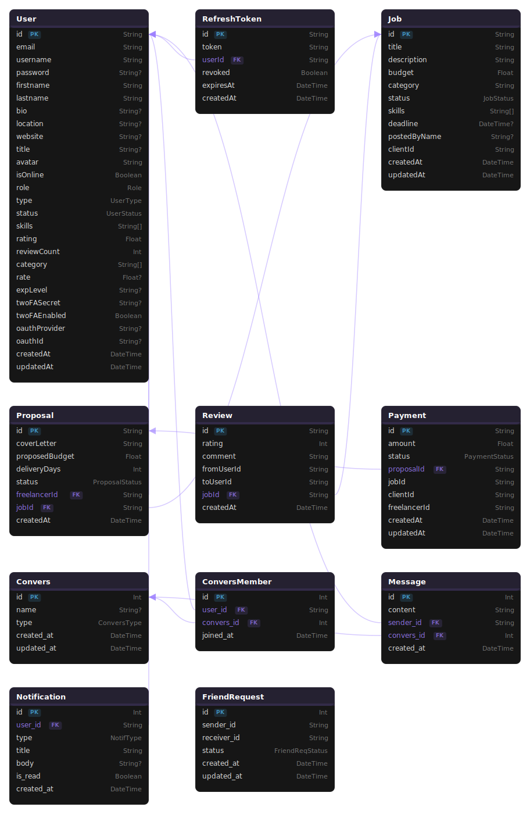

*This project has been created as part of the 42 curriculum by noben-ai, ner-roui, adbouras, abmahfou, amezioun.*

# LeetConnect

## Description

LeetConnect is a freelancing platform developed in the 42 curriculum. The project is built with a microservices architecture and supports three user roles: client, freelancer, and mods.


### Project Overview

Users can register and authenticate, browse or post jobs, communicate in real time, and use role-based dashboards.
The backend is split into independent services behind an Nginx gateway, with PostgreSQL and Redis as core infrastructure.

### Key Features

- Role-based platform (client / freelancer / admin)
- Authentication, OAuth, and 2FA
- Marketplace workflows (jobs, proposals, contracts)
- Real-time chat and notifications
- Analytics and admin APIs
- Monitoring with Prometheus + Grafana + cAdvisor

## Instructions

### Required configuration (`.env`)

At minimum, configure:

- `POSTGRES_USER`, `POSTGRES_PASSWORD`
- `AUTH_DB_*`, `MARKET_DB_*`, `CHAT_DB_*`, `ANALYTICS_DB_*`
- `JWT_SECRET`
- `REDIS_URL`
- `GRAFANA_ADMIN_USER`, `GRAFANA_ADMIN_PASSWORD`
- OAuth variables if OAuth login is tested locally (`GOOGLE_*`, `GITHUB_*`)

### Run the project (step-by-step)

1. Clone the repository.
2. Create/update the root `.env` file.
3. Start the stack:

```bash
make
```

4. Other useful commands:

- `make health` — check service health endpoints.
- `make ps` — show running containers.
- `make logs` — follow combined logs.
- `make down` — stop the stack.
- `make clean` — remove containers, volumes, and generated certs.

5. Open the main entrypoints:

- `https://localhost` (frontend)
- `http://localhost:9090` (Prometheus)
- `http://localhost:3000` (Grafana)
- `http://localhost:8080` (cAdvisor)


## Team Information

| Login | Assigned Role(s) | Responsibilities |
|------|-------------------|------------------|
| `noben-ai` | Project Manager & Dev (Auth) | Auth service, login/register, OAuth/2FA integration, profile settings |
| `ner-roui` | Dev (Marketplace) | Marketplace service, jobs/proposals/contracts workflows |
| `adbouras` | Dev (Chat) | Chat service, notifications, Profile  |
| `abmahfou` | Product Owner & Dev (Analytics/Admin) | Analytics and admin service |
| `amezioun` | Tech Lead / Infra Dev | Docker Compose, Nginx, monitoring stack, environment orchestration |

## Project Management
- Regular communication: Organized weekly meetings to sync on progress, blockers, and upcoming milestones.
- Communication channel: Kept a dedicated Discord Server active for quick questions, decisions, and updates between team members.
- Code reviews: Enforced the rule “no direct pushes to dev” by requiring at least one teammate to review and approve pull requests before merge.

### Work organization

- Vertical-slice ownership by service.
- Shared integration through gateway + service APIs + common infrastructure.
- Infra changes validated end-to-end with Docker Compose.

### Communication

- Team communication channel: Discord.
- Weakly Meetings.

## Technical Stack

### Frontend

- React

### Backend

- Node.js
- Express.js

### Database and cache

- PostgreSQL (single instance with logical DB separation)
- Redis (pub/sub and shared event communication)

#### db schema



## Infrastructure & Monitoring: `amezioun`

### What this work includes

- Docker Compose orchestration for the services you actually run.
- Nginx reverse proxy and HTTPS routing.
- PostgreSQL and Redis containers.
- Prometheus, Grafana, and cAdvisor monitoring.
- Health checks and operational Makefile commands.

#### Goal

- Provide a reproducible local environment.
- Route frontend and backend traffic through one gateway.
- Keep the services networked correctly.
- Expose metrics for observability.
- Make the stack easy to run and debug.


### Infra Tech Stack

#### Used techs

- Docker and Docker Compose
- Nginx
- PostgreSQL
- Redis
- Prometheus
- Grafana
- cAdvisor

#### Why these tools

- **Docker Compose** keeps the stack reproducible and easy to start.
- **Nginx** is the single HTTPS reverse proxy for the project.
- **PostgreSQL** stores the service databases.
- **Redis** is used for pub/sub and shared event communication.
- **Prometheus** collects metrics from services and containers.
- **Grafana** visualizes the collected metrics.
- **cAdvisor** provides container CPU and memory metrics.

### Infra Layout

#### Services map


| Service | Port | Responsibility | Main Dependencies |
|---------|------|----------------|-------------------|
| `nginx` | `80/443` | Reverse proxy, HTTPS termination, request routing | `frontend`, `auth`, `marketplace`, `chat`, `analytics`, `admin` |
| `frontend` | `5173` | Public React application entrypoint | `nginx` |
| `auth` | `3001` | Authentication, OAuth, 2FA, profiles, auth health/metrics | `postgres`, `redis` |
| `marketplace` | `3002` | Jobs, proposals, contracts, marketplace health/metrics | `postgres`, `redis`, `auth` |
| `chat` | `3003` | Real-time messaging, conversations, notifications, Socket.IO | `postgres`, `redis`, `auth` |
| `analytics` | `3004` | Analytics/event APIs and reporting | `postgres`, `redis`, `auth` |
| `admin` | `3005` | Admin API layer over core services | `auth`, `marketplace`, `analytics` |
| `postgres` | `5432` | Shared PostgreSQL instance with logical databases | `auth`, `marketplace`, `chat`, `analytics` |
| `redis` | `6379` | Event bus and pub/sub | `auth`, `marketplace`, `chat`, `analytics` |
| `prometheus` | `9090` | Metrics collection and alert rule evaluation | `auth`, `marketplace`, `chat`, `analytics`, `admin`, `cadvisor` |
| `grafana` | `3000` | Metrics dashboards and visualization | `prometheus` |
| `cadvisor` | `8080` | Container resource monitoring | 

#### Network flow

- Internet traffic reaches **Nginx** first.
- Nginx routes traffic to the frontend or the backend services.
- Backend services communicate with PostgreSQL and Redis over the Docker network.
- Prometheus scrapes metrics from the services and cAdvisor.
- Grafana reads data from Prometheus.


#### Data boundaries

- PostgreSQL is one container, but each service uses its own logical database and credentials.
- Services do not directly read each other’s tables.
- Cross-service data needs are handled through service APIs and event communication.

#### Event communication

- Redis is used as the event bus/pub-sub channel between services.
- This supports decoupled updates (for example, profile/user state and chat-related synchronization).

#### Health and observability per service

- Each backend service exposes a health endpoint behind Nginx.
- Each backend service exposes `/metrics` for Prometheus scraping.
- Prometheus target jobs are configured for `auth`, `marketplace`, `chat`, `analytics`, and `admin`.

### Monitoring

#### What is monitored

- service availability
- request rate
- request latency
- container CPU usage
- container memory usage
- cAdvisor availability

#### Alert rules

The Prometheus rule file currently covers:

- backend services going down
- cAdvisor going down

#### Grafana

Grafana is configured with Prometheus as its datasource.


## Authentication: `noben-ai`
### What this work includes

1. **User registration & login**
   * Email/password signup with strong password rules, role/type selection, and duplicate checks.  
   * Passwords hashed with bcrypt; issues short-lived JWT access tokens plus DB-backed refresh tokens.  
   * Publishes user events to Redis so other services stay in sync.

2. **2FA with TOTP**
   * Optional authenticator-app 2FA using TOTP secrets and QR codes.  
   * Login flow splits into temp “pending 2FA” tokens and final tokens after code verification.  
   * Rate limiting on setup, verify, login, and disable to mitigate brute force.

3. **OAuth (42 Intra)**
   * OAuth login via Passport strategy for 42 accounts.  
   * Auto-creates or links users based on 42 profile, with basic conflict/error handling.  
   * OAuth-only users rely on 42 for auth and do not configure local 2FA.

4. **Token & session security**
   * RS256 JWT access tokens, opaque refresh tokens in httpOnly cookies.  
   * Auto-refresh on 401 from the frontend, plus logout and suspension-based revocation.  
   * Central auth middleware verifies tokens, roles/types, and revoked sessions.

5. **Profile Updates**
	* Supports avatar uploads with rate limiting (per-user limiter)
	* 2FA settings available only for password-based accounts (not OAuth users)
	* Backend validates all updates and publishes `user.updated` event so other services receive the updates


## Marketplace: `ner-roui`

### What this work includes

#### 1. Job Lifecycle Management
Built the full job posting and management system exposing REST routes under `/api/marketplace/jobs/*`.

* Jobs follow a strict status progression: `OPEN` → `IN_PROGRESS` → `PAYMENT_PENDING` → `COMPLETED`, with `FLAGGED` and `CLOSED` as admin-controlled states
* Clients can create, update, and delete jobs — edits and deletions are locked once a job leaves `OPEN` status to preserve contract integrity
* `GET /jobs` supports rich filtering: full-text search across title and description, category, budget range (`minBudget` / `maxBudget`), required skills (comma-separated), and status
* `FLAGGED` jobs are silently excluded from all public listings

#### 2. Proposal System
Designed the full proposal workflow between freelancers and clients, including resubmission and rejection logic.

* One proposal record per `(freelancerId, jobId)` — resubmissions update the existing row rather than creating duplicates
* Freelancers may resubmit after rejection up to **2 times** (3 total attempts); `rejectionCount >= 2` permanently blocks further submissions on that job
* Proposal acceptance runs as an **atomic transaction**: job moves to `IN_PROGRESS`, the accepted proposal is marked `ACCEPTED`, all remaining pending proposals are bulk-rejected, and a `Payment` record is created in a single operation — preventing race conditions on concurrent acceptance

#### 3. Payment Flow
Implemented a simple but guarded payment lifecycle attached to accepted proposals.

* A `Payment` record (status `PENDING`) is automatically created when a proposal is accepted
* Only the client who owns the payment can trigger `PATCH /payments/:id/pay`; only `PENDING` payments are payable
* Both the client and the accepted freelancer can view their shared payment record
* Payments are stored in cents (`Int`) to avoid floating-point precision issues

#### 4. Review System
Built a cross-review system gated behind job completion.

* Reviews are only allowed on jobs with status `COMPLETED`
* Only the **client** and the **accepted freelancer** can review each other — self-reviews are blocked
* One review per `(fromUserId, jobId)` enforced by a unique constraint
* `GET /reviews/:userId` returns the full review history for any user

#### 5. Event Publishing
Marketplace emits events to the shared Redis bus to keep other services in sync.

* `JOB_CREATED` / `JOB_UPDATED` / `JOB_DELETED` — keep Analytics and Admin dashboards current
* `PROPOSAL_ACCEPTED` — triggers Chat and Notification service workflows (conversation creation, notifications)
* `REVIEW_SUBMITTED` — notifies the reviewed user and updates their profile rating
* `NOTIF_CREATE` — dispatched on proposal acceptance, rejection, and review actions
---

## Chat: `adbouras`

### What this work includes

#### 1. Chat Microservice
Built a dedicated `chat` service behind the Nginx gateway exposing REST routes under `/api/chat/*`, `/api/friend/*`, `/api/notifs/*` and a Socket.IO endpoint at `/socket.io/`.

* Owns its own Postgres database (`chat_db`); cross-service user data arrives via Redis pub/sub (`user.registered` / `user.updated` / `user.deleted`) and is mirrored in a local "shadow" `User` table
* Conversations modeled as `Convers` (Direct or Group) + `ConversMember` join + `Message` with `(convers_id, created_at)` index for cursor-paginated history
* Per-route rate limiters keyed by `userId` — `write_limiter` (50 / 10 min) on conversation and friend writes; `message_limiter` (30 / min) on send; reads exempted via `skip: req.method === 'GET'`
* Global `1000 / 15 min` per-IP limiter as outer wall, skipping `/metrics` and `/health`

#### 2. WebSocket Layer (Socket.IO)
* JWT-authenticated handshake at `io.use()` using the RS256 public key shared from the auth service
* Three room conventions: `user:<id>` (per-user pushes), `presence:<id>` (status transitions), `convers:<id>` (live message delivery)
* Server → client events: `new_message`, `delete_message`, `convers_bumped`, `presence_changed`, `new_notification`, `friend_request_*`, `friend_removed`
* Client → server events: `watch_presence` / `unwatch_presence`, `join_convers` / `leave_convers`, `chat_active`
* Graceful disconnect cleanup that calls `mark_offline`

#### 3. Presence System
Real-time `online/offline` status powering friends list dots, chat headers, conversation pannel and the profile page.

* Redis SET `presence:sockets:<userId>` holds every live socket id; `SCARD = 0` ⇒ offline, `SCARD > 0` ⇒ online
* Per-user `presence:<id>` rooms with explicit `watch_presence` subscriptions from the frontend, so broadcasts are bounded by viewers
* `mark_online` / `mark_offline` only emit on 0↔1 transitions; extra tabs of the same user are silent
* `reset_presence` on boot and `shutdown_presence` on SIGTERM guarantee clean state across container restarts
* Frontend `PresenceProvider` exposes `usePresence(userId)` (refcounted) and `usePresenceSeed()` (bulk cache from REST)

#### 4. Friend System
* `FriendRequest` model with `PENDING` → `ACCEPTED` / `REJECTED` transitions and `@@unique([sender_id, receiver_id])`
* Endpoints: `POST /requests`, `PATCH /:id/accept`, `PATCH /:id/reject`, `DELETE /friends`, `GET /incoming` / `/outgoing` / `/friends`
* Re-send after reject deletes the old row and creates a fresh `PENDING` in one transaction
* Group `add_member` requires friendship between requester and invitee

#### 5. Notification System
* `Notification` table (`MESSAGE` / `FRIEND_REQ` / `SYSTEM`)
* Created via a `notify()` helper that inserts the row then publishes `notif.create` on the Redis bus; subscriber emits `new_notification` over the socket
* **On-chat suppression**: backend skips `MESSAGE` notifications for recipients whose sockets have `data.chatActive === true` (set by frontend on mount/unmount of `/chat`)
* **Dedup**: rapid bursts from the same sender update an existing unread `MESSAGE` row instead of creating new ones
* `PATCH /:id/read` and `PATCH /read-all` push `notification_read` so all open tabs sync

#### 6. Profile Page
* `/profile/:username` (any user) and `/profile` (own); fetched via `GET /api/chat/users/:username`
* `ProfileHeader` displays avatar, name, username, title, type, location, joined date, bio
* Live online dot via `usePresence(targetUserId)`  works for any user
* Friend status button with four states: `Connect`, `Request Sent`, `Accept / Reject`, `Connected` (hover-to-Disconnect)
* "Message" button creates or reuses a Direct conversation and navigates to `/chat?conv=<id>`
* Inline `RateLimitBanner` with countdown when `write_limiter` triggers; action buttons disabled until clear

#### 7. Network Page
* `/network` aggregates friends, incoming, and outgoing requests
* Each friend card has a live online dot fed by `usePresence(friend.id)`
* Inline `accept/reject` buttons

---

## Analytics and admin: `abmahfou`

### What this work includes

#### 1. Role-Based Access Control (RBAC) System
Designed and implemented a complete permission system from scratch covering both frontend enforcement and backend protection.

* Defined a three-tier role hierarchy — `ADMIN`, `MODERATOR`, `USER` — where higher roles inherit all permissions of lower roles
* Implemented three permission helpers — `hasRole`, `hasPermission`, and `canAccess` (hierarchy-aware) — exposed globally via React Context
* Built `CanAccess` component for conditional UI rendering supporting role, roles, permission, and minRole props simultaneously
* Built `ProtectedRoute` component for route-level access control with automatic redirect to `/admin/login` for unauthenticated users and `/403` for unauthorized ones

#### 2. Admin Dashboard Overview
* Built the main admin dashboard page showing platform-wide metrics — total users, total jobs, flagged jobs with pulsing alert badge, suspended users
* Implemented "Recent Users" and "Recent Jobs" tables with live navigation to management pages
* Flagged jobs are automatically floated to the top of the Recent Jobs table and highlighted with a red tint row and flag icon
* "Manage" action button adapts its label and color per job status — shows "Review" in red for flagged jobs

#### 3. User Management System

* `GET /api/admin/users` — full user listing with simultaneous search across name, email, and username fields using Prisma OR with mode: insensitive, plus role and status filters
* `PATCH /api/admin/users/:id/role` — role update with self-modification protection and atomic TOCTOU-safe Prisma query using where: { role: { not: 'ADMIN' } }
* `PATCH /api/admin/users/:id/status` — status update with same protections
* `DELETE /api/admin/users/:id` — permanent deletion with self-deletion protection
* Frontend `UsersPage` features role stat cards (clickable to filter), search, role dropdown filter, inline role editing with optimistic updates and automatic rollback on failure, suspend/activate toggle, and two-step delete confirmation

#### 4. Job Management System

* `GET /api/admin/jobs` — full job listing with search across title, description, and category, plus status.
* `PATCH /api/admin/jobs/:id/status` — status transition endpoint supporting flag, restore, and close actions
* `DELETE /api/admin/jobs/:id` — permanent job removal
* Frontend `JobsPage` features a status tab bar with live counts, multi-filter toolbar, inline flag/unflag and delete actions with confirmation, and a slide-in detail drawer showing full job information, skill tags, client details, status changer, and delete action
* Drawer updates in real-time — changing status in the drawer simultaneously updates the table row badge without closing and reopening

#### 5. Roles & Permissions Page

* Built `GET /api/admin/roles` endpoint that returns the complete role configuration including labels, descriptions, permission lists, and real user counts per role via` prisma.user.groupBy`
* Frontend is a pure renderer — zero hardcoded permission data, everything comes from the backend
* Permission checklist grouped by category (Users, Roles, Content) with granted/denied visual indicators
* Full comparison matrix showing all roles side-by-side for every permission
* Role selector cards show real-time user counts from the database

#### 6. Analytics Dashboard
##### Backend — three dedicated endpoints:
* `GET /api/admin/analytics/overview` — platform-wide absolute counts (total users, total jobs, active jobs, flagged jobs, suspended users, new this week) using `Promise.all` for parallel query execution
* `GET /api/admin/analytics/users` — user registration time-series using prisma.$queryRaw with PostgreSQL `DATE_TRUNC('day', createdAt)`, plus role distribution and status breakdown via `groupBy`
* `GET /api/admin/analytics/jobs` — job posting time-series, status breakdown, category ranking, and average proposals via `prisma.job.aggregate`
* Both time-series endpoints support preset ranges (`7d`, `30d`, `90d`, `1y`) and custom date ranges (`from` / `to` ISO strings) with full Zod validation including future-date prevention and from-before-to enforcement
* `bigint` results from `$queryRaw` safely converted to `Number` before JSON serialization

##### Frontend — full visualization layer:
* `DateRangePicker` — preset tab bar plus custom date range via react-datepicker
* `UserRegistrationsChart` — Recharts `LineChart` with custom dark-themed tooltip
* `JobsOverTimeChart` — Recharts `BarChart` with rounded bar tops
* `RoleDistributionChart` — Recharts `PieChart` with custom legend showing counts and percentages
* `JobStatusChart` — Recharts donut chart with center total count display
* `CategoryChart` — pure div-based horizontal bar chart with proportional fill widths
* Real-time updates via 30-second polling using `setInterval` with `fetchAll(false)` for silent background refresh — no loading flash during updates — with "last updated X seconds ago" indicator
* `Promise.all` on all three endpoints for simultaneous fetch

#### 7. Export Functionality
- **CSV export** — multi-section file generated entirely client-side using `papaparse` from already-fetched React state, covering overview metrics, registration trends, role breakdown, job trends, category ranking, and status breakdown. Zero server round-trip on export

#### Challenges Faced & How They Were Overcome

* **Handling Data Serialization & Type Mismatches**
  Encountered issues when serializing complex database types (like Postgres BigInt) into JSON for the frontend.
  * **Solution:** Implemented a standardized transformation layer in the backend controllers to cast raw database outputs into JS-compatible formats.

* **Optimizing Frontend Performance for Heavy Analytics**
	Balancing real-time data accuracy with UI responsiveness when handling large datasets and frequent polling.
	* **Solution**: Implemented background data fetching (silent refreshes) and optimized Recharts rendering. Used Promise.all to parallelize API requests, significantly reducing initial load times for the analytics dashboard.

* **Ensuring Data Consistency in Microservices**
	Maintaining a local "shadow" database for the Admin/Analytics services while keeping it in sync with the Auth service without direct database coupling.

	* **Solution**: We developed an event-driven synchronization system using Redis. Leveraged the "upsert" pattern to handle incoming user events, ensuring the admin dashboard remains accurate without creating cross-service dependencies.

## Modules

### Major modules
- **Major: Use a framework for both the frontend and backend.**
- **Major: Implement real-time features using WebSockets or similar technology.**
- **Major: Allow users to interact with other users. The minimum requirements are.**
- **Major: Standard user management and authentication.**
- **Major: Advanced permissions system.**
- **Major: Monitoring system with Prometheus and Grafana.**
- **Major: Backend as microservices.**
- **Major: Advanced analytics dashboard with data visualization.**

### Minor modules
- **Minor: Use a frontend framework (React, Vue, Angular, Svelte, etc.).**
- **Minor: Use a backend framework (Express, Fastify, NestJS, Django, etc.).**
- **Minor: Use an ORM for the database.**
- **Minor: A complete notification system for all creation, update, and deletion actions.**
- **Minor: Custom-made design system with reusable components.**
- **Minor: Implement advanced search functionality with filters, sorting, and pagination.**
- **Minor: Implement remote authentication with OAuth 2.0.**
- **Minor: Implement a complete 2FA.**
- **Minor: User activity analytics and insights dashboard.**

## Resources

- [Docker Documentation](https://docs.docker.com/)
- [Docker Compose Documentation](https://docs.docker.com/compose/)
- [Nginx Documentation](https://nginx.org/en/docs/)
- [PostgreSQL Documentation](https://www.postgresql.org/docs/)
- [Redis Documentation](https://redis.io/docs/latest/)
- [Prometheus Documentation](https://prometheus.io/docs/)
- [Grafana Documentation](https://grafana.com/docs/)
- [cAdvisor GitHub Repository](https://github.com/google/cadvisor)
- [portswigger jwt documentation](https://portswigger.net/web-security/jwt#what-are-jwts)
- [Authentication flow on the web](https://jsmastery.com/blogs/authentication-flow-on-the-web)
- [Password storage methods](https://www.youtube.com/watch?v=qgpsIBLvrGY)
- [Oauth 2.0](https://oauth.net/2/)
- [Access and Refresh tokens](https://www.geeksforgeeks.org/javascript/access-token-vs-refresh-token-a-breakdown/)
- [Socket.IO documentation](https://socket.io/docs/v4/)
- [Socket.IO client API](https://socket.io/docs/v4/client-api/)
- [Redis Pub/Sub](https://redis.io/docs/latest/develop/interact/pubsub/)
- [Redis Sets](https://redis.io/docs/latest/develop/data-types/sets/)
- [Prisma documentation](https://www.prisma.io/docs)
- [express-rate-limit](https://express-rate-limit.mintlify.app/)
- [Recharts Guide](https://recharts.github.io/en-US/guide/getting-started/)
- [Papaparse Docs](https://www.papaparse.com/docs)
